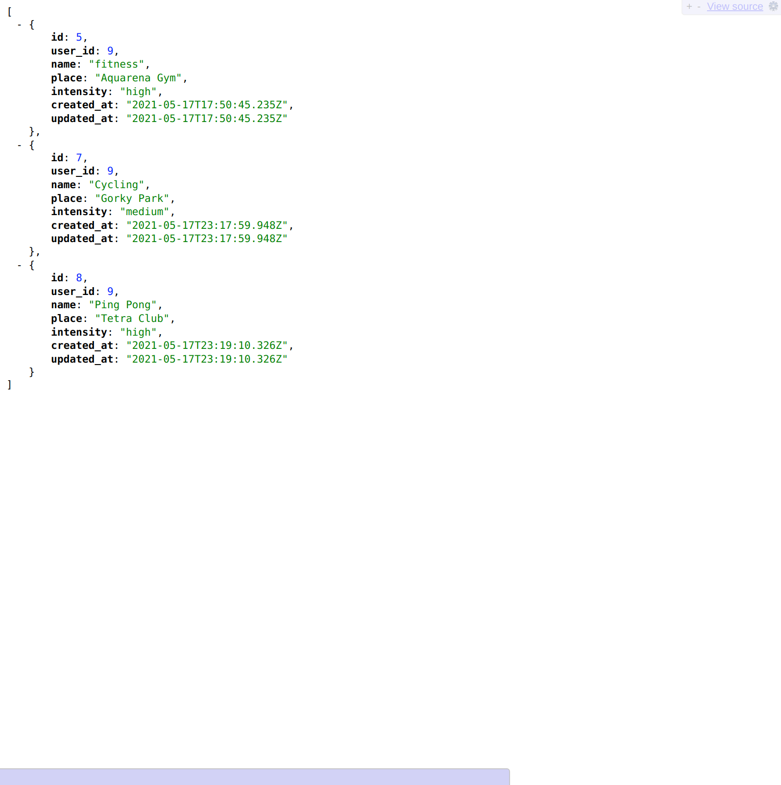

## Api-back
This is a REST API for managing database resources, in this case there are 3 tables in the database - this project has Users, Activities(their actions,  like sports trainings) and Trainings (monitored parameters, such as date, duration, distance, pulse, rate, etc.) ).
To create, view and edit activities and their tracked parameters of this User, "password_digest" and "cookies" are used.
This rails api deployed on Heroku and assign to work with the react mobile app, where will bee the user interface.

### 'api-back' API documentation
I have added a new documentary for the API as the nice-to-have feature for my Final Capstone project.
This documentation is available here:  
[Publish Documentation / POSTMAN](https://documenter.getpostman.com/view/13821409/TzRSgnE8#f2e32b87-f733-4bc0-a600-213056730823)

### Live Demo

[Live Demo](https://final-api-backend.herokuapp.com/) it only accessible for the [app-front](https://app-front.netlify.app/) Frontend

- 
- 
- 

### Prerequisites

- Ruby v2.7.2
- Ruby on Rails v6.1.3.1
- Postgres: >=9.5
- Rspec
- Heroku

### Getting Started

To get a local copy up and running follow these simple example steps.
- `git clone https://github.com/Laguna1/api-back/tree/development`
- `cd api-back`

### Setup

Instal gems with:

- `bundle install`

Setup database with:
 - `rails db:create`
 - `rails db:migrate`

### Usage

Start server with:

- `rails s`

Open `http://localhost:3000/` in your browser.

### Run tests

- `rspec`

### Author

👤 **Oksana Petrova**

- GitHub: [@github/Laguna1](https://github.com/Laguna1)
- Linkedin: [linkedin/OksanaPetrova](https://www.linkedin.com/in/oksana-petrova/)
- Twitter: [@OksanaP48303303](https://twitter.com/OksanaP48303303)

### 🤝 Contributing

Contributions, issues and feature requests are welcome!

Feel free to check the [issues page](https://github.com/Laguna1/api-back/issues)

### Show your support

Give a ⭐️ if you like this project!

### Acknowledgments

You can access all the design info - color, typography, layouts - at this link:

### 📝 License
This project is [MIT](https://github.com/Laguna1/api-back/LICENSE) licensed.
