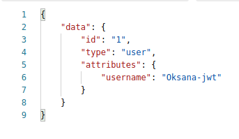

## Api-back
This is a REST API for managing database resources, in this case, there are 3 tables in the database - in this project, there are Users, Activs (a choice of dates for creating a track), and Tracks (tracked parameters such as duration, distance, repeаts of training exercises).
For security in the API token-based authentication is used
For the correct and structured display of JSON data, used the serializers.
This rails API is deployed to Heroku and assigned to work with the React mobile app where the UI will be.

### 'api-back' API documentation
I have added a new documentary for the API as the nice-to-have feature for my Final Capstone project.
This documentation is available here:  
[Publish Documentation / POSTMAN](https://documenter.getpostman.com/view/13821409/TzRSgnE8#f2e32b87-f733-4bc0-a600-213056730823)

### Live Demo

[Live Demo](https://final-api-backend.herokuapp.com/) it only accessible for the [app-front](https://app-front.netlify.app/) Frontend

- 
- 
- 
- 

### Prerequisites

- Ruby v2.7.2
- Ruby on Rails v6.1.3.1
- Postgres: >=9.5
- Rspec
- Heroku

### Getting Started

To get a local copy up and running follow these simple example steps.
- `git clone https://github.com/Laguna1/api-back/tree/development`
- `cd api-back`

### Setup

Instal gems with:

- `bundle install`

Setup database with:
 - `rails db:create`
 - `rails db:migrate`

### Usage

Start server with:

- `rails s`

Open `http://localhost:3000/` in your browser.

### Run tests

- `rspec`

### Author

👤 **Oksana Petrova**

- GitHub: [@github/Laguna1](https://github.com/Laguna1)
- Linkedin: [linkedin/OksanaPetrova](https://www.linkedin.com/in/oksana-petrova/)
- Twitter: [@OksanaP48303303](https://twitter.com/OksanaP48303303)

### 🤝 Contributing

Contributions, issues and feature requests are welcome!

Feel free to check the [issues page](https://github.com/Laguna1/api-back/issues)

### Show your support

Give a ⭐️ if you like this project!

### Acknowledgments

You can access all the design info - color, typography, layouts - at this link:

### 📝 License
This project is [MIT](https://github.com/Laguna1/api-back/LICENSE) licensed.
